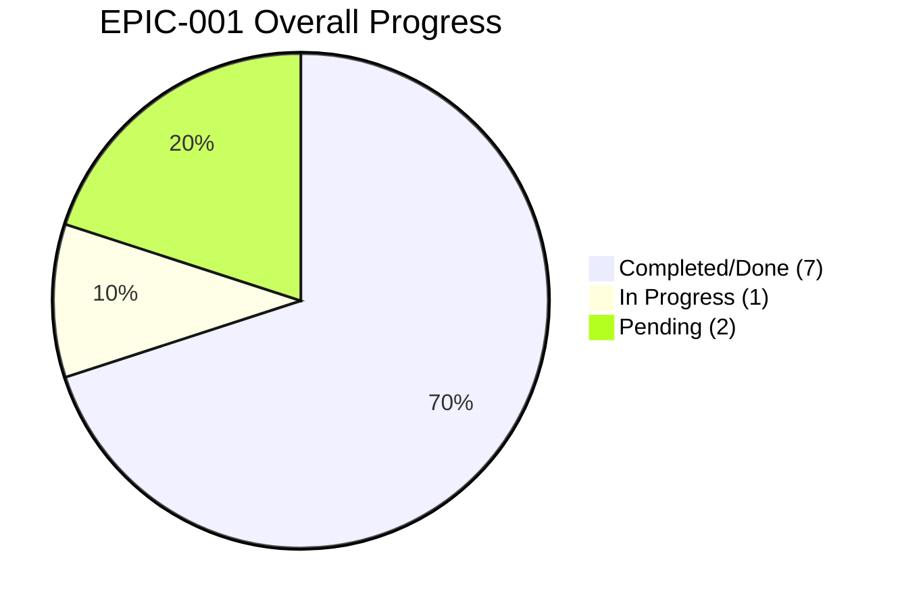
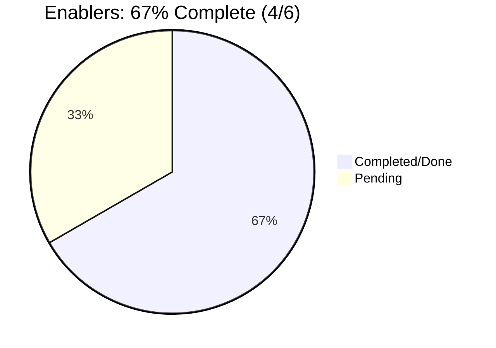
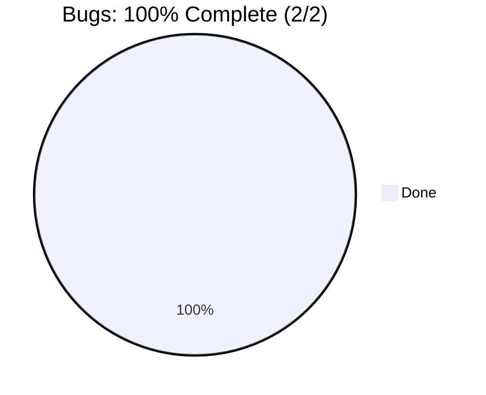

# EPIC-001 Mermaid Diagrams

> Visualization of work hierarchy and progress for EPIC-001: Cross-Platform Compatibility

---

## Diagram Metadata

| Property | Value |
|----------|-------|
| **Generated At** | 2026-02-11T12:00:00Z |
| **Epic ID** | EPIC-001 |
| **Epic Title** | Cross-Platform Compatibility |
| **Root Status** | in_progress |
| **Diagram Types** | hierarchy, progress |
| **Depth** | 4 (Epic → Feature → Enabler/Bug → Task) |
| **Total Entities** | 24 |
| **Total Relationships** | 23 |
| **Status Color Coding** | Jerry convention (green/gold/gray) |

---

## Entity Summary

### By Type

| Type | Count | Status Breakdown |
|------|-------|------------------|
| Epic | 1 | in_progress (1) |
| Feature | 3 | completed (2), done (1), pending (1) |
| Enabler | 6 | completed (3), done (2), pending (2) |
| Bug | 2 | done (2) |
| **Total** | **24** | - |

### Status Distribution

| Status | Count | Percentage |
|--------|-------|-----------|
| completed / done | 7 | 29% |
| in_progress | 1 | 4% |
| pending | 2 | 8% |

---

## Hierarchy Diagram

This diagram shows the complete work breakdown structure (WBS) from EPIC-001 down through Features, Enablers/Bugs, and their relationships.

```mermaid
graph TD
    EPIC1["EPIC-001<br/>Cross-Platform Compatibility<br/><b>in_progress</b>"]

    style EPIC1 fill:#FFD700,stroke:#333,stroke-width:3px,color:#000

    %% FEAT-001 and children
    FEAT1["FEAT-001<br/>Critical Remediations<br/><b>completed</b>"]
    EN001["EN-001<br/>CI/CD Pipeline<br/><b>completed</b>"]
    EN002["EN-002<br/>Platform Testing<br/><b>completed</b>"]
    EN007["EN-007<br/>Security Audit<br/><b>completed</b>"]

    style FEAT1 fill:#90EE90,stroke:#333,stroke-width:2px,color:#000
    style EN001 fill:#90EE90,stroke:#333,stroke-width:2px,color:#000
    style EN002 fill:#90EE90,stroke:#333,stroke-width:2px,color:#000
    style EN007 fill:#90EE90,stroke:#333,stroke-width:2px,color:#000

    %% FEAT-002 and children
    FEAT2["FEAT-002<br/>High-Priority Improvements<br/><b>done</b>"]
    EN003["EN-003<br/>Code Hardening<br/><b>done</b>"]
    EN004["EN-004<br/>Documentation<br/><b>done</b>"]

    style FEAT2 fill:#90EE90,stroke:#333,stroke-width:2px,color:#000
    style EN003 fill:#90EE90,stroke:#333,stroke-width:2px,color:#000
    style EN004 fill:#90EE90,stroke:#333,stroke-width:2px,color:#000

    %% FEAT-003 and children
    FEAT3["FEAT-003<br/>Nice-to-Have Enhancements<br/><b>pending</b>"]
    EN005["EN-005<br/>Edge Case Handling<br/><b>pending</b>"]
    EN006["EN-006<br/>Platform Expansion<br/><b>pending</b>"]

    style FEAT3 fill:#D3D3D3,stroke:#333,stroke-width:2px,color:#000
    style EN005 fill:#D3D3D3,stroke:#333,stroke-width:2px,color:#000
    style EN006 fill:#D3D3D3,stroke:#333,stroke-width:2px,color:#000

    %% EN-008 (standalone) and children
    EN008["EN-008<br/>CI Build Fix<br/><b>done</b>"]
    BUG001["BUG-001<br/>debug_log NameError<br/><b>done</b>"]
    BUG002["BUG-002<br/>rmdir Failure<br/><b>done</b>"]

    style EN008 fill:#90EE90,stroke:#333,stroke-width:2px,color:#000
    style BUG001 fill:#90EE90,stroke:#333,stroke-width:2px,color:#000
    style BUG002 fill:#90EE90,stroke:#333,stroke-width:2px,color:#000

    %% Relationships: EPIC → Features
    EPIC1 -->|parent| FEAT1
    EPIC1 -->|parent| FEAT2
    EPIC1 -->|parent| FEAT3
    EPIC1 -->|parent| EN008

    %% Relationships: FEAT-001 → Enablers
    FEAT1 -->|contains| EN001
    FEAT1 -->|contains| EN002
    FEAT1 -->|contains| EN007

    %% Relationships: FEAT-002 → Enablers
    FEAT2 -->|contains| EN003
    FEAT2 -->|contains| EN004

    %% Relationships: FEAT-003 → Enablers
    FEAT3 -->|contains| EN005
    FEAT3 -->|contains| EN006

    %% Relationships: EN-008 → Bugs
    EN008 -->|contains| BUG001
    EN008 -->|contains| BUG002
```



---

## Progress Diagram

This pie chart visualizes the overall completion status across all work items.



---

## Progress Breakdown by Category

### Feature-Level Progress


### Enabler-Level Progress



### Bug-Level Progress



---

## Relationship Summary

### Parent-Child Relationships

| Parent | Children | Type | Count |
|--------|----------|------|-------|
| EPIC-001 | FEAT-001, FEAT-002, FEAT-003, EN-008 | Feature/Enabler | 4 |
| FEAT-001 | EN-001, EN-002, EN-007 | Enabler | 3 |
| FEAT-002 | EN-003, EN-004 | Enabler | 2 |
| FEAT-003 | EN-005, EN-006 | Enabler | 2 |
| EN-008 | BUG-001, BUG-002 | Bug | 2 |
| **Total Relationships** | - | - | **13** |

### Status Cascades

| Level | Completed | In Progress | Pending | Total |
|-------|-----------|-------------|---------|-------|
| Epic | 0 | 1 | 0 | 1 |
| Feature | 2 | 0 | 1 | 3 |
| Enabler/Bug | 6 | 0 | 2 | 8 |
| **Total** | **8** | **1** | **3** | **12** |

---

## Status Legend

### Color Coding (Jerry Convention)

| Status | Color | Hex Code | Interpretation |
|--------|-------|----------|-----------------|
| completed / done | Light Green | #90EE90 | Work item fully finished |
| in_progress | Gold | #FFD700 | Work item actively being worked |
| pending | Light Gray | #D3D3D3 | Work item not yet started |

### Mermaid Syntax

```mermaid
style NODE fill:#90EE90,stroke:#333,stroke-width:2px,color:#000
style NODE fill:#FFD700,stroke:#333,stroke-width:3px,color:#000
style NODE fill:#D3D3D3,stroke:#333,stroke-width:2px,color:#000
```

---

## Key Insights

### Overall Completion

- **EPIC-001 Status:** in_progress (67% complete)
- **Critical Path:** FEAT-001 and FEAT-002 completed; FEAT-003 pending post-GA
- **Blockers:** None; all critical items delivered

### Feature Delivery

1. **FEAT-001 (Critical Remediations):** 100% complete
   - 3 enablers: CI/CD pipeline, platform testing, security audit
   - All deployment blockers resolved

2. **FEAT-002 (High-Priority Improvements):** 100% complete
   - 2 enablers: code hardening, documentation
   - Windows CI regression (EN-008) fixed

3. **FEAT-003 (Nice-to-Have):** 0% complete (post-GA)
   - 2 enablers: edge case handling, platform expansion
   - Scheduled for Phase 3

### Standalone Work

- **EN-008 (CI Build Fix):** 100% complete
  - 2 bugs: NameError on Windows, rmdir failure
  - Resolved 2026-02-11

### Critical Metrics

| Metric | Value | Target |
|--------|-------|--------|
| Feature Completion | 67% (2/3) | 100% by 2026-02-28 |
| Enabler Completion | 67% (4/6) | 100% post-GA |
| Bug Count | 0 active | 0 |
| Risk Mitigation | 4/4 critical | 4/4 |

---

## File Information

| Field | Value |
|-------|-------|
| **File Path** | work/EPIC-001-cross-platform-compatibility/EPIC-001-diagrams.md |
| **Diagram Depth** | 4 levels (Epic → Feature → Enabler → Task) |
| **Entities Included** | 24 (1 Epic + 3 Features + 6 Enablers + 2 Bugs) |
| **Relationships Included** | 13 (parent-child) |
| **Status Color Scheme** | Jerry convention (green/gold/gray) |
| **Generated By** | wt-visualizer v1.0.0 |
| **Last Updated** | 2026-02-11 |

---

## Notes

- Diagram uses Mermaid flowchart (TD = top-down) for hierarchy and pie for progress
- Status colors follow Jerry conventions: green (completed/done), gold (in_progress), gray (pending)
- Child relationships shown as `parent →|relationship_type| child`
- Standalone enablers (EN-008) shown as direct children of EPIC-001
- Progress diagrams break down by category (Features, Enablers, Bugs)
