# EPIC-001: Cross-Platform Compatibility - Hierarchy Diagram

**Generated:** 2026-02-10
**Status:** pending
**Scope:** Cross-Platform Compatibility Initiative

---

## Metadata

- **entities_included:** 37 (1 EPIC + 3 FEATURES + 6 ENABLERS + 27 TASKS)
- **max_depth_reached:** 4 (Epic → Feature → Enabler → Task)
- **completion_rate:** 16.2% (6 of 37 items completed)
- **critical_items:** FEAT-001 (pending), EN-002 (pending)
- **completed_items:** EN-001, EN-007 (all child tasks)

---

## Status Color Key

| Status | Color | Hex |
|--------|-------|-----|
| completed | Light Green | #90EE90 |
| in_progress | Gold | #FFD700 |
| pending | Light Gray | #D3D3D3 |
| blocked | Light Red | #FF6B6B |

## Hierarchy Flowchart

```mermaid
flowchart TD
    EPIC["EPIC-001: Cross-Platform Compatibility<br/>Status: pending"]

    EPIC --> FEAT001["FEAT-001: Critical Remediations<br/>Status: pending"]
    EPIC --> FEAT002["FEAT-002: High-Priority Improvements<br/>Status: pending"]
    EPIC --> FEAT003["FEAT-003: Nice-to-Have Enhancements<br/>Status: pending"]

    %% FEAT-001 Children
    FEAT001 --> EN001["EN-001: CI/CD Pipeline Implementation<br/>Status: completed"]
    FEAT001 --> EN002["EN-002: Platform Verification Testing<br/>Status: pending"]
    FEAT001 --> EN007["EN-007: Security and PII Audit<br/>Status: completed"]

    %% EN-001 Tasks
    EN001 --> TASK001["TASK-001: Create Workflow"]
    EN001 --> TASK002["TASK-002: Configure Matrix"]
    EN001 --> TASK003["TASK-003: Branch Protection"]
    EN001 --> TASK004["TASK-004: Validate Pipeline"]

    %% EN-002 Tasks
    EN002 --> TASK201["TASK-001: Windows Testing"]
    EN002 --> TASK202["TASK-002: Linux Testing"]
    EN002 --> TASK203["TASK-003: Docker Testing"]
    EN002 --> TASK204["TASK-004: Alpine Exclusion"]
    EN002 --> TASK205["TASK-005: Linux Docs"]
    EN002 --> TASK206["TASK-006: Read-only Filesystem"]

    %% FEAT-002 Children
    FEAT002 --> EN003["EN-003: Code Hardening<br/>Status: pending"]
    FEAT002 --> EN004["EN-004: Documentation Completion<br/>Status: pending"]

    %% EN-003 Tasks
    EN003 --> TASK301["TASK-001: Subprocess Encoding"]
    EN003 --> TASK302["TASK-002: HOME Variable"]
    EN003 --> TASK303["TASK-003: Emoji Fallback"]
    EN003 --> TASK304["TASK-004: VS Code Testing"]

    %% EN-004 Tasks
    EN004 --> TASK401["TASK-001: Container Docs"]
    EN004 --> TASK402["TASK-002: Platform Exclusions"]
    EN004 --> TASK403["TASK-003: Schema Notes"]
    EN004 --> TASK404["TASK-004: Uninstall Docs"]
    EN004 --> TASK405["TASK-005: WSL Clarification"]
    EN004 --> TASK406["TASK-006: CI Badge"]
    EN004 --> TASK407["TASK-007: Changelog Update"]

    %% FEAT-003 Children
    FEAT003 --> EN005["EN-005: Edge Case Handling<br/>Status: pending"]
    FEAT003 --> EN006["EN-006: Platform Expansion<br/>Status: pending"]

    %% EN-005 Tasks
    EN005 --> TASK501["TASK-001: NO_COLOR Support"]
    EN005 --> TASK502["TASK-002: UNC Paths"]
    EN005 --> TASK503["TASK-003: Git Timeout"]
    EN005 --> TASK504["TASK-004: SSH/tmux Docs"]
    EN005 --> TASK505["TASK-005: Atomic Writes"]
    EN005 --> TASK506["TASK-006: Color Toggle"]

    %% EN-006 Tasks
    EN006 --> TASK601["TASK-001: ARM Linux Testing"]
    EN006 --> TASK602["TASK-002: Windows ARM Testing"]
    EN006 --> TASK603["TASK-003: FreeBSD Consideration"]
    EN006 --> TASK604["TASK-004: Upgrade Path"]
    EN006 --> TASK605["TASK-005: Schema Version Check"]

    %% Styling - Epic
    style EPIC fill:#D3D3D3,stroke:#333,stroke-width:2px,color:#000

    %% Styling - Features
    style FEAT001 fill:#D3D3D3,stroke:#333,stroke-width:2px,color:#000
    style FEAT002 fill:#D3D3D3,stroke:#333,stroke-width:2px,color:#000
    style FEAT003 fill:#D3D3D3,stroke:#333,stroke-width:2px,color:#000

    %% Styling - Enablers (Completed)
    style EN001 fill:#90EE90,stroke:#333,stroke-width:2px,color:#000
    style EN007 fill:#90EE90,stroke:#333,stroke-width:2px,color:#000

    %% Styling - Enablers (Pending)
    style EN002 fill:#D3D3D3,stroke:#333,stroke-width:2px,color:#000
    style EN003 fill:#D3D3D3,stroke:#333,stroke-width:2px,color:#000
    style EN004 fill:#D3D3D3,stroke:#333,stroke-width:2px,color:#000
    style EN005 fill:#D3D3D3,stroke:#333,stroke-width:2px,color:#000
    style EN006 fill:#D3D3D3,stroke:#333,stroke-width:2px,color:#000

    %% Styling - Tasks (EN-001: All Completed)
    style TASK001 fill:#90EE90,stroke:#333,stroke-width:1px,color:#000
    style TASK002 fill:#90EE90,stroke:#333,stroke-width:1px,color:#000
    style TASK003 fill:#90EE90,stroke:#333,stroke-width:1px,color:#000
    style TASK004 fill:#90EE90,stroke:#333,stroke-width:1px,color:#000

    %% Styling - Tasks (EN-002: All Pending)
    style TASK201 fill:#D3D3D3,stroke:#333,stroke-width:1px,color:#000
    style TASK202 fill:#D3D3D3,stroke:#333,stroke-width:1px,color:#000
    style TASK203 fill:#D3D3D3,stroke:#333,stroke-width:1px,color:#000
    style TASK204 fill:#D3D3D3,stroke:#333,stroke-width:1px,color:#000
    style TASK205 fill:#D3D3D3,stroke:#333,stroke-width:1px,color:#000
    style TASK206 fill:#D3D3D3,stroke:#333,stroke-width:1px,color:#000

    %% Styling - Tasks (EN-003: All Pending)
    style TASK301 fill:#D3D3D3,stroke:#333,stroke-width:1px,color:#000
    style TASK302 fill:#D3D3D3,stroke:#333,stroke-width:1px,color:#000
    style TASK303 fill:#D3D3D3,stroke:#333,stroke-width:1px,color:#000
    style TASK304 fill:#D3D3D3,stroke:#333,stroke-width:1px,color:#000

    %% Styling - Tasks (EN-004: All Pending)
    style TASK401 fill:#D3D3D3,stroke:#333,stroke-width:1px,color:#000
    style TASK402 fill:#D3D3D3,stroke:#333,stroke-width:1px,color:#000
    style TASK403 fill:#D3D3D3,stroke:#333,stroke-width:1px,color:#000
    style TASK404 fill:#D3D3D3,stroke:#333,stroke-width:1px,color:#000
    style TASK405 fill:#D3D3D3,stroke:#333,stroke-width:1px,color:#000
    style TASK406 fill:#D3D3D3,stroke:#333,stroke-width:1px,color:#000
    style TASK407 fill:#D3D3D3,stroke:#333,stroke-width:1px,color:#000

    %% Styling - Tasks (EN-005: All Pending)
    style TASK501 fill:#D3D3D3,stroke:#333,stroke-width:1px,color:#000
    style TASK502 fill:#D3D3D3,stroke:#333,stroke-width:1px,color:#000
    style TASK503 fill:#D3D3D3,stroke:#333,stroke-width:1px,color:#000
    style TASK504 fill:#D3D3D3,stroke:#333,stroke-width:1px,color:#000
    style TASK505 fill:#D3D3D3,stroke:#333,stroke-width:1px,color:#000
    style TASK506 fill:#D3D3D3,stroke:#333,stroke-width:1px,color:#000

    %% Styling - Tasks (EN-006: All Pending)
    style TASK601 fill:#D3D3D3,stroke:#333,stroke-width:1px,color:#000
    style TASK602 fill:#D3D3D3,stroke:#333,stroke-width:1px,color:#000
    style TASK603 fill:#D3D3D3,stroke:#333,stroke-width:1px,color:#000
    style TASK604 fill:#D3D3D3,stroke:#333,stroke-width:1px,color:#000
    style TASK605 fill:#D3D3D3,stroke:#333,stroke-width:1px,color:#000
```



---

## Progress Summary

### Metrics

| Metric | Value |
|--------|-------|
| **Total Entities** | 37 |
| **Completed Entities** | 6 |
| **Pending Entities** | 31 |
| **In Progress Entities** | 0 |
| **Blocked Entities** | 0 |
| **Completion Rate** | 16.2% |

### Breakdown by Level

| Level | Type | Total | Completed | Pending | Progress |
|-------|------|-------|-----------|---------|----------|
| 0 | Epic | 1 | 0 | 1 | 0% |
| 1 | Feature | 3 | 0 | 3 | 0% |
| 2 | Enabler | 6 | 2 | 4 | 33.3% |
| 3 | Task | 27 | 4 | 23 | 14.8% |

## Phase Breakdown

### Phase 1: Critical Remediations (FEAT-001)
- **Status:** pending
- **Priority:** CRITICAL
- **Completion:** 2/9 items (22.2%)
  - EN-001 (CI/CD Pipeline): ✅ COMPLETED - 4/4 tasks done
  - EN-002 (Platform Verification): ⏳ PENDING - 0/6 tasks done
  - EN-007 (Security Audit): ✅ COMPLETED - 4/4 tasks done

### Phase 2: High-Priority Improvements (FEAT-002)
- **Status:** pending
- **Priority:** HIGH
- **Completion:** 0/11 items (0%)
  - EN-003 (Code Hardening): ⏳ 4 tasks pending
  - EN-004 (Documentation): ⏳ 7 tasks pending
  - Blocked by: FEAT-001 EN-002 completion

### Phase 3: Nice-to-Have (FEAT-003)
- **Status:** pending
- **Priority:** MEDIUM
- **Completion:** 0/11 items (0%)
  - EN-005 (Edge Cases): ⏳ 6 tasks pending
  - EN-006 (Platform Expansion): ⏳ 5 tasks pending
  - Blocked by: FEAT-002 completion

## Critical Path Analysis

**Current Status:** EN-002 Platform Verification Testing is the critical blocker

```
EPIC-001 (pending)
  └─ FEAT-001 (pending) ← CRITICAL
       ├─ EN-001 ✅ COMPLETED (CI/CD Pipeline: 4/4 tasks)
       ├─ EN-002 ⏳ BLOCKING (Platform Verification: 0/6 tasks)
       └─ EN-007 ✅ COMPLETED (Security Audit: 4/4 tasks)
```

**Release Gates:**
1. Complete EN-002 (Platform Verification Testing)
2. Complete FEAT-001 → Unblock FEAT-002
3. Complete FEAT-002 → Enable FEAT-003
4. Full completion → GA Ready (target 2026-02-21)

## Completed Work Items

### EN-001: CI/CD Pipeline Implementation
- **Status:** Completed (100%)
- **All Tasks:** ✅ TASK-001 through TASK-004
- **Achievement:** Multi-platform CI/CD matrix (3 OS × 4 Python versions) fully operational
- **Evidence:** All 12 CI jobs passing (Run #21647672703)

### EN-007: Security and PII Audit
- **Status:** Completed (100%)
- **All Tasks:** ✅ PII scan, tool config, adversarial critique, remediation
- **Achievement:** Zero security findings, all scans passing
- **Evidence:** Comprehensive security audit completed with no critical issues

## Next Milestone

**Target:** 2026-02-14 (Platform Verification Testing Complete)
- Start EN-002 platform testing tasks
- Execute Windows 10/11 verification
- Execute Ubuntu 22.04 verification
- Execute Docker container testing
- Document Alpine Linux as unsupported
